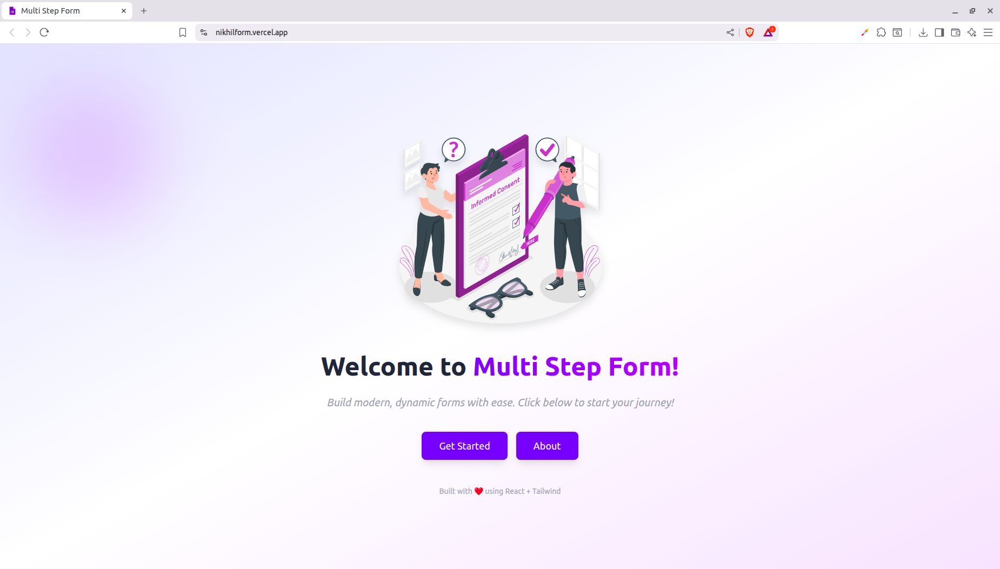
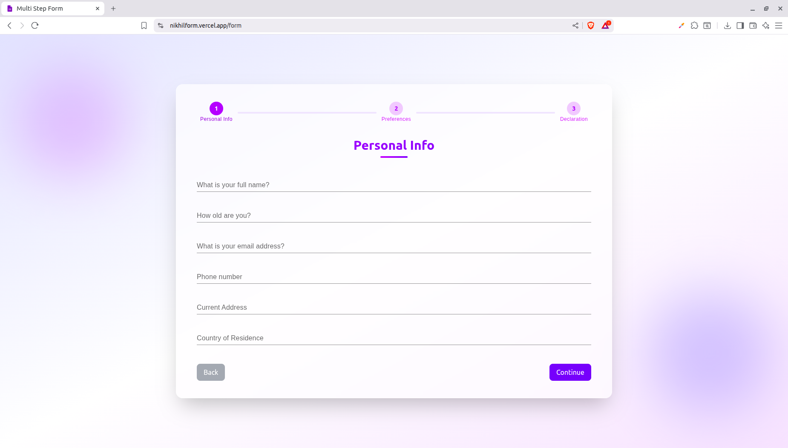
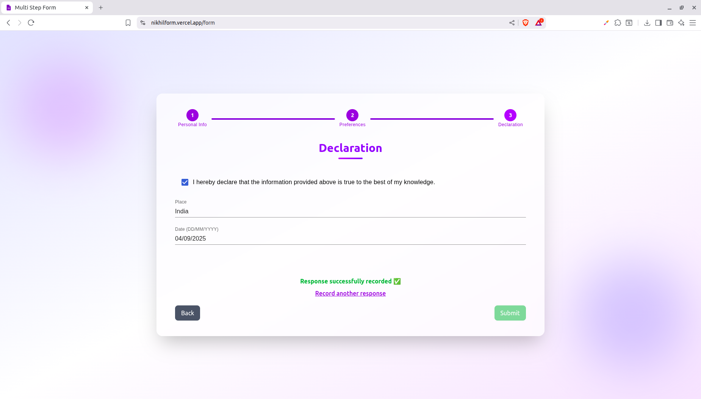
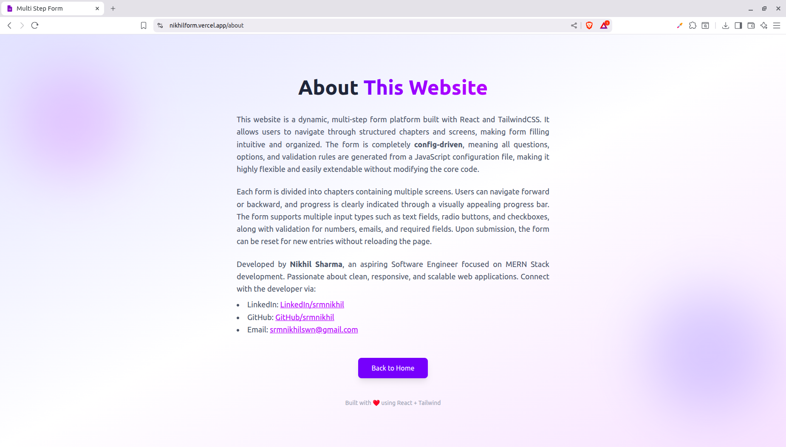

# Multi-step Form

A modern, responsive **multi-step form** built with **React**, **Tailwind CSS**, and **Material-UI (MUI)**. Fully **config-driven**, it allows dynamic form creation with text fields, radio buttons, checkboxes, validation, and chapter-wise progress tracking.

---

## Features

- **Config-driven**: Easily add or modify chapters, screens, and questions in a single config file.  
- **Supports multiple input types**: Text, radio, and checkbox.  
- **Validation included**: Required fields, numbers, emails, and range checks.  
- **Progress tracking**: Visual chapter-wise progress bar with numbered milestones.  
- **Responsive design**: Works smoothly on desktop and mobile devices.  
- **Smooth navigation**: Next/Back buttons with Enter key support.  
- **Submission handling**: View submitted answers and reset the form without page reload.

---

## Screenshots






---

## Installation

1. Clone the repository:

```bash
git clone https://github.com/srmnikhil/multistep-form.git
```

2. Install Dependencies:
```bash
npm install
```

3. Start the development server:
```bash
npm run dev
# or
npm start
```
## Usage

- Navigate through the form using **Continue** and **Back** buttons.
- Required fields must be filled to proceed.
- Track your progress with the **chapter-wise progress bar** at the top.
- Submit the form and view your responses.
- Reset the form for a fresh start after submission.

## Config File
All chapters, screens, and questions are defined in config.js. Example:
```bash
const chapters = [
  {
    id: "chapter1",
    title: "Personal Info",
    screens: [
      {
        id: "screen1",
        questions: [
          { id: "fullName", type: "text", label: "Full Name", required: true },
          { id: "age", type: "text", label: "Age", required: true, validation: "number" }
        ],
      },
      // More screens...
    ],
  },
  // More chapters...
];
```

## Technologies Used
- **React** - Frontend library for building the UI.
- **Tailwind CSS** - Utility-first CSS for styling.
- **Material-UI (MUI)** - Components for inputs and progress bars.
- **React Router** - Navigation between pages.

## About the Developer
- **Nikhil Sharma** - Full Stack Developer (MERN Stack)
- [LinkedIn](https://linkedin.com/in/srmnikhil)
- [GitHub](https://github.com/srmnikhil)
- Email: srmnikhilswn@gmail.com

## License
- This project is **open-source** and free to use for personal or commercial purposes.

---

If you want, I can also make a **more visually appealing version** with badges for React, Tailwind, MUI, and NPM, so your GitHub looks extra professional.  

Do you want me to do that?
